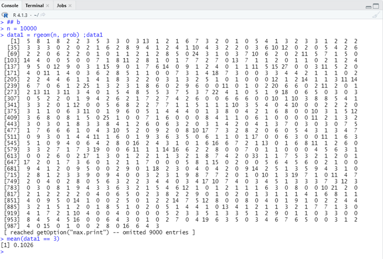

# P1_Probstat_E_5025201228
Laporan Praktikum Modul 1 Probabilitas dan Statistik 2022

Distribusi Probabilitas

## Soal 1 
Seorang penyurvei secara acak memilih orang-orang di jalan sampai dia bertemu dengan seseorang yang menghadiri acara vaksinasi sebelumnya.

### 1.a
Berapa peluang penyurvei bertemu x = 3 orang yang tidak menghadiri acara vaksinasi
sebelum keberhasilan pertama ketika p = 0,20 dari populasi menghadiri acara vaksinasi ?
(distribusi Geometrik).

``` r
x = 3
prob = 0.20

## a
dgeom(x, prob)
```


**Hasil** : 0.1024

**Penjelasan** : Menggunakan fungsi `dgeom()` untuk mencari distribusi geometrik dengan diketahui nilai `x = 3` dan `prob = 0.20`.

### 1.b
mean Distribusi Geometrik dengan 10000 data random , prob = 0,20 dimana distribusi
geometrik acak tersebut X = 3 ( distribusi geometrik acak () == 3 ).

``` r
n = 10000
data1 = rgeom(n, prob)
mean(data1 == 3)
```



**Hasil** : 0.1067

**Penjelasan** : Menggunakan fungsi `rgeom()` untuk mencari distribusi geometrik dengan n data random, kemudian dicari `mean()` untuk `X == 3`.

### 1.c
Bandingkan Hasil poin a dan b , apa kesimpulan yang bisa didapatkan?

**Jawab** :

Berdasarkan perhitungan ataupun nilai bangkitan, fungsi probabilitasnya memiliki rentang nilai yang tidak berbeda, dimana hasil pada poin a adalah `0.1024` dan poin b adalah `0.1067`.

### 1.d
Histogram Distribusi Geometrik , Peluang X = 3 gagal Sebelum Sukses Pertama

``` r
hist(data1)
```


**Penjelasan** : menggunakan fungsi `hist()` untuk membuat histogram distribusi geometrik dari `data1`

### 1.e
Nilai Rataan (μ) dan Varian (σ²) dari Distribusi Geometrik.

``` r
mean(data1)
var(data1)
```


**Hasil** : 
- Rataan (μ)  = 3.9981
- Varian (σ²) = 19.74407

**Penjelasan** : Menggunakan fungsi `mean()` dan `var()` untuk mencari nilai rataan dan varian dari `data1`.
