# P1_Probstat_E_5025201228
Laporan Praktikum Modul 1 Probabilitas dan Statistik 2022

Distribusi Probabilitas

**Nama  : Arief Badrus Sholeh**

**NRP   : 5025201228**

**Kelas : Probabilitas dan Statistik E**

***

## Soal 1 
Seorang penyurvei secara acak memilih orang-orang di jalan sampai dia bertemu dengan seseorang yang menghadiri acara vaksinasi sebelumnya.

### 1.a
Berapa peluang penyurvei bertemu x = 3 orang yang tidak menghadiri acara vaksinasi
sebelum keberhasilan pertama ketika p = 0,20 dari populasi menghadiri acara vaksinasi ?
(distribusi Geometrik).

``` r
x = 3
prob = 0.20

## a
dgeom(x, prob)
```


**Hasil** : 0.1024

**Penjelasan** : Menggunakan fungsi `dgeom()` untuk mencari distribusi geometrik dengan diketahui nilai `x = 3` dan `prob = 0.20`.

### 1.b
mean Distribusi Geometrik dengan 10000 data random , prob = 0,20 dimana distribusi
geometrik acak tersebut X = 3 ( distribusi geometrik acak () == 3 ).

``` r
## b
n = 10000
data1 = rgeom(n, prob)
mean(data1 == 3)
```


**Hasil** : 0.1026

**Penjelasan** : Menggunakan fungsi `rgeom()` untuk mencari distribusi geometrik dengan n data random, kemudian dicari `mean()` untuk `X == 3`.

### 1.c
Bandingkan Hasil poin a dan b , apa kesimpulan yang bisa didapatkan?

**Jawab** :

Berdasarkan perhitungan ataupun nilai bangkitan, fungsi probabilitasnya memiliki rentang nilai yang tidak berbeda, dimana hasil pada poin a adalah 0.1024 dan poin b adalah 0.1026.

### 1.d
Histogram Distribusi Geometrik , Peluang X = 3 gagal Sebelum Sukses Pertama

``` r
## d
hist(data1, main = "Histogram Geometrik", col = 'red')
```

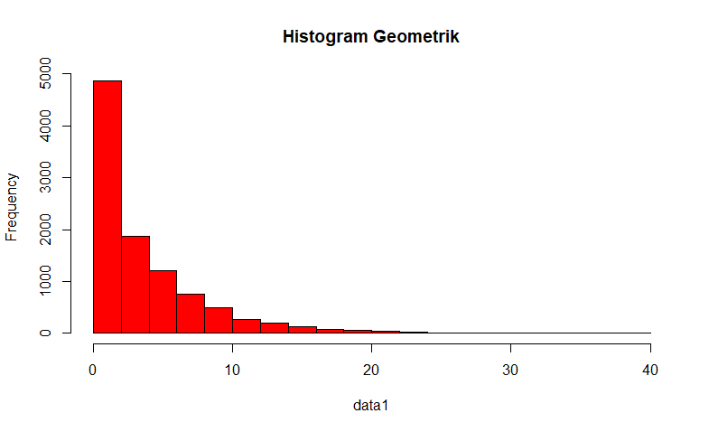

**Penjelasan** : menggunakan fungsi `hist()` untuk membuat histogram distribusi geometrik dari `data1`

### 1.e
Nilai Rataan (μ) dan Varian (σ²) dari Distribusi Geometrik.

``` r
## e
mean = 1/prob ;mean

var = (1-prob)/prob^2 ;var
```

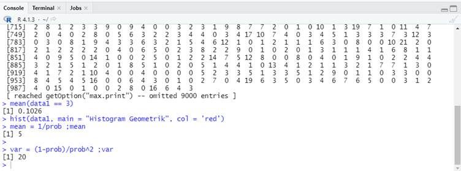

**Hasil** : 
- Rataan (μ)  = 5
- Varian (σ²) = 20

**Penjelasan** : Untuk mencari mean pada distribusi geometrik menggunakan rumus `1/p` sedangkan untuk mencari varian mengunakan rumus `(1-p)/p^2`.

***

## Soal 2
Terdapat 20 pasien menderita Covid19 dengan peluang sembuh sebesar 0.2. Tentukan :

### 2.a
Peluang terdapat 4 pasien yang sembuh.

``` r
x = 4
size = 20
prob = 0.2

## a
dbinom(x, size, prob)
```


**Hasil** : 0.2181994

**Penjelasan** : Menggunakan fungsi `dbinom()` untuk mencari distribusi binomial dengan diketahui nilai `x = 4`, `size = 20`, dan `prob = 0.2`.

### 2.b
Gambarkan grafik histogram berdasarkan kasus tersebut.

``` r
## b
n = 100
data2 = rbinom(n, size, prob) ;data2

hist(data2, main = "Histogram Binomial", col = "green")
```

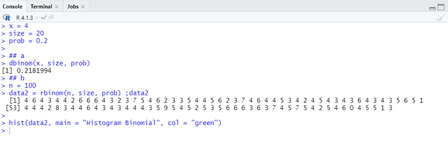


**Penjelasan** : Menggunakan fungsi `rbinom()` untuk mencari distribusi binomial dengan n data random (karena tidak disebutkan disoal, maka mengambil nilai sembarang `n = 100`) dan fungsi `hist()` untuk membuat histogram distribusi binomial dari `data2`.

### 2.c
Nilai Rataan (μ) dan Varian (σ²) dari Distribusi Binomial.

``` r
## c
mean = size * prob ;mean

var = size * prob * (1 - prob) ;var
```

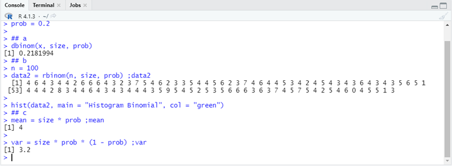

**Hasil** :
- Rataan (μ)  = 4
- Varian (σ²) = 3.2

**Penjelasan** : Untuk mencari mean pada distribusi geometrik menggunakan rumus `n*p` sedangkan untuk mencari varian mengunakan rumus `n*p*(1 - p)`.

***

## Soal 3
Diketahui data dari sebuah tempat bersalin di rumah sakit tertentu menunjukkan rata-rata historis 4,5 bayi lahir di rumah sakit ini setiap hari. (gunakan Distribusi Poisson).

### 3.a
Berapa peluang bahwa 6 bayi akan lahir di rumah sakit ini besok?

``` r
x = 6
lambda = 4.5

## a
dpois(x, lambda)
```

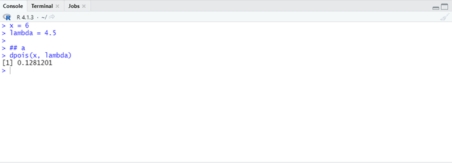

**Hasil** : 0.1281201

**Penjelasan** : Menggunakan fungsi `dpois()` untuk mencari distribusi poission dengan diketahui nilai `x = 6` dan `lambda = 4.5`

### 3.b
Simulasikan dan buatlah histogram kelahiran 6 bayi akan lahir di rumah sakit ini selama
setahun (n = 365)

``` r
## b
n = 365
data3 = rpois(n, lambda) ;data3

hist(data3, main = "Histogram Poisson", col = "blue")
```


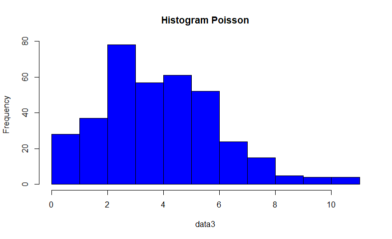

**Penjelasan** : Menggunakan fungsi `rpois()` untuk mencari distribusi poisson dengan n data random dan fungsi `hist()` untuk membuat histogram dari `data3`

### 3.c
Bandingkan hasil poin a dan b , Apa kesimpulan yang bisa didapatkan.

**Jawab** :

Jika kita cari nilai rata-rata untuk distribusi poisson pada poin b dengan menggunakan syntax

``` r
## c
mean(data3 == 6)
## Penjelasan ada di Github
```


Maka nilai yang diperoleh adalah 0.1424658.

Dapat diambil kesuimpulan bahwa berdasarkan perhitungan ataupun nilai bangkitan, fungsi probabilitasnya memiliki rentang nilai yang tidak berbeda, dimana hasil pada poin a adalah 0.1281201.


### 3.d
Nilai Rataan (μ) dan Varian (σ²) dari Distribusi Poisson.

``` r
## d
mean = lambda ;mean

var = lambda ;var
```

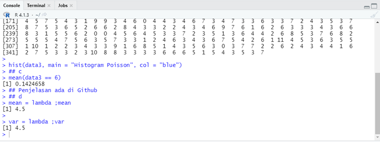

**Hasil** :
- Rataan (μ)  = 4.5
- Varian (σ²) = 4.5

***Penjelasan** : Nilai rataan dan varian pada distribusi poisson sama dengan nilal `lambda`.

## Soal 4
Diketahui nilai x = 2 dan v = 10. Tentukan:

### 4.a
Fungsi Probabilitas dari Distribusi Chi-Square.

``` r
x = 2
df = 10

## a
dchisq(x, df)
```


**Hasil** : 0.007664155

**Penjelasan** : Menggunakan fungsi `dchisq()` untuk mencari distribusi chi-square.

### 4.b
Histogram dari Distribusi Chi-Square dengan 100 data random.

``` r
## b
n = 100
data4 = rchisq(n, df) ;data4

hist(data4, main = "Histogram Chi-Square", col = "yellow")
```

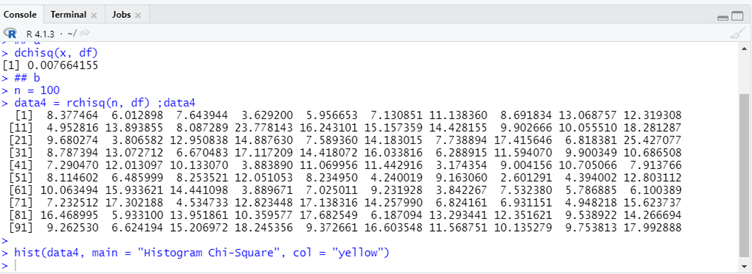

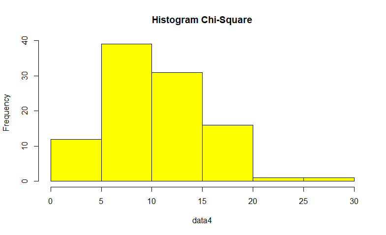

**Penjelasan** : Menggunakan fungsi `rchisq()` untuk mencari distribusi chi-square dengan n data random dan fungsi `hist()` untuk membuat histogram dari `data4`

### 4.c
Nilai Rataan (μ) dan Varian (σ²) dari DistribusiChi-Square.

``` r
## c
mean = df ;mean

var = 2*df ;var
```

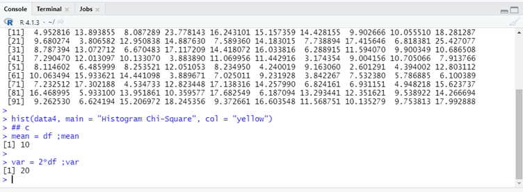

**Hasil** :
- Rataan (μ)  = 10
- Varian (σ²) = 20

**Penjelasan** : Nilai mean pada distribusi chi-square sama dengan nilai `v` (dalam hal ini `df`) sedangkan untuk mencari varian mengunakan rumus `2*v`.

***

## Soal 5
Diketahui bilangan acak (random variable) berdistribusi exponential (λ = 3). Tentukan

### 5.a
Fungsi Probabilitas dari Distribusi Exponensial

``` r
x = 3

## a
dexp(1, x)
```

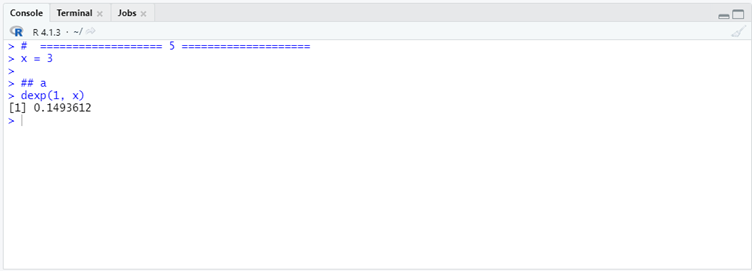

**Hasil** : 0.1493612

**Penjelasan** : Menggunakan fungsi `dexp()` untuk mencari distribusi exponensial dengan diketahui nilai `x = 3`.

### 5.b
Histogram dari Distribusi Exponensial untuk 10, 100, 1000 dan 10000 bilangan random

``` r

## b
set.seed(1)
hist(rexp(10, x), main = "Histogram Exponential (n = 10)", col = "cyan")
hist(rexp(100, x), main = "Histogram Exponential (n = 100)", col = "cyan")
hist(rexp(1000, x), main = "Histogram Exponential (n = 1000)", col = "cyan")
hist(rexp(10000, x), main = "Histogram Exponential (n = 10000)", col = "cyan")
```

- `n = 10`
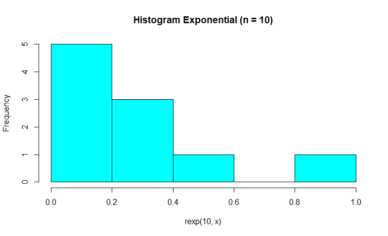
- `n = 100`
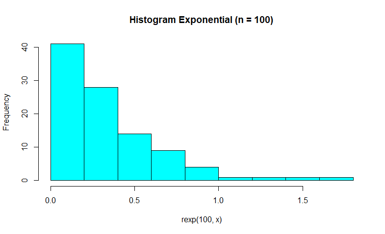
- `n = 1000`

- `n = 10000`
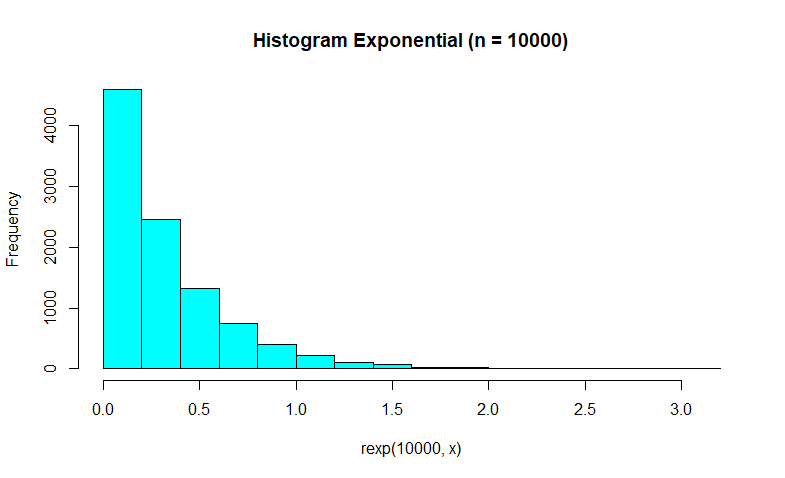

**Penjelasan** : Menggunakan fungsi `rexp()` untuk mencari distribusi exponensial dengan n data random dan fungsi `hist()` untuk membuat histogramnya.

### 5.c
Nilai Rataan (μ) dan Varian (σ²) dari Distribusi Exponensial untuk n = 100 dan λ = 3

``` r
## c
n = 100
data5 = rexp(n, x)

mean(data5)

var(data5)
```


**Hasil** : 
- Rataan (μ)  = 0.3675159
- Varian (σ²) = 0.1202852

**Penjelasan** : Menggunakan fungsi `mean()` dan `var()` untuk mencari nilai rataan dan varian dari `data5`.

***

## Soal 6
Diketahui generate random nilai sebanyak 100 data, mean = 50, sd = 8. Tentukan

### 6.a
Fungsi Probabilitas dari Distribusi Normal P(X1 ≤ x ≤ X2), hitung Z-Score Nya dan plot data generate randomnya dalam bentuk grafik.

``` r
n = 100
mean = 50
sd = 8

## a
data5 = rnorm(n, mean, sd) ;data5

mean(data5)

X1 = 50
X2 = 51

Z2 = (X2-mean(data5))/sd(data5) ;Z2
Z1 = 1-((X1-mean(data5))/sd(data5)) ;Z1
Z = Z1 +Z2 ;Z

plot(data5, main = "Plot Data5", col = "salmon", pch = 1)
```


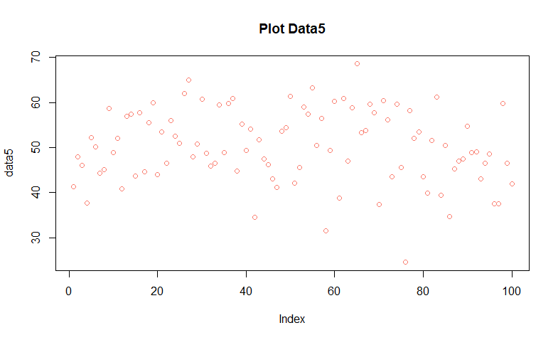

**Hasil** : 
- Z-score = 1.123113

**Penjelasan** : Karena default Z-score pada distribusi normal untuk `P(x<=X2)` sehingga untuk mendapatkan `P(X1<=x<=X2)` adalah dengan `P(x<=X2) + (1 - P(x<=X1))` karena `(1 - P(x<=X1)) = P(x>=X1)`. Kemudian menggunakan fungsi `plot()` untuk plot data generate randomnya dalam bentuk grafik


### 6.b
Generate Histogram dari Distribusi Normal dengan breaks 50

``` r
## b
hist(data5, main = "5025201228_Arief Badrus Sholeh_Probstat_E_DNHistogram", breaks = 50, col = "salmon")
```


**Penjelasan** : Menggunkan fungsi `hist()` untuk meng-Generate histogram distribusi normal dengan `breaks = 50`.

### 6.c
Nilai Varian (σ²) dari hasil generate random nilai Distribusi Normal.

``` r
## c
var(data5)
```


**Hasil** :
- Varian (σ²) = 65.97666

**Penjelasan** : Menggunakan fungsi `var()` untuk mencari nilai varian dari `data5`.

***

 Sekian dan Terima Kasih